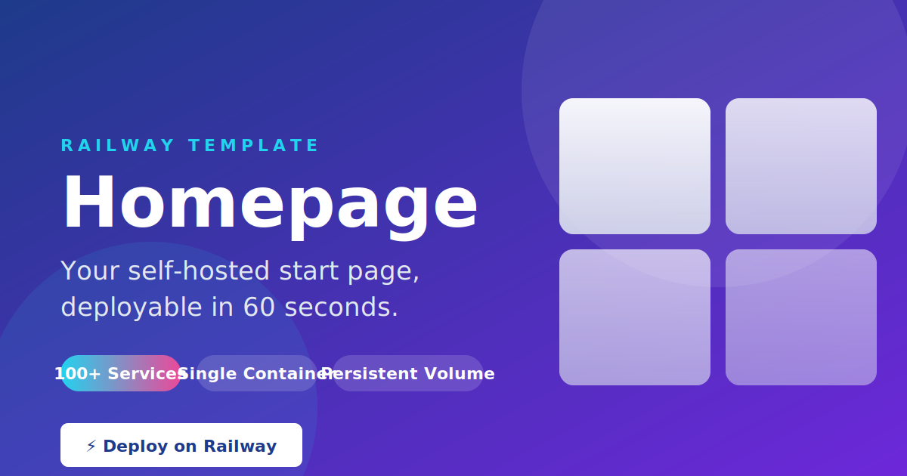

# Homepage — Railway Template

[](https://railway.app/template/homepage)
[](https://github.com/gethomepage/homepage)
[](https://github.com/gethomepage/homepage/blob/main/LICENSE)
[](https://github.com/gethomepage/homepage)

<p align="center">
  
</p>

## 🚀 One-Click Deploy

Click the button above to deploy **Homepage** to Railway instantly. The build uses our pinned, reproducible Dockerfile (Homepage v1.13.2).

## 📋 Description

**Homepage** is a modern, highly-configurable self-hosted application dashboard with **100+ service integrations**. It turns your Railway stack into a beautiful start page featuring live status, monitoring widgets, bookmarks, and custom service cards — everything you need at a glance when you open a new tab.

This template ships a **production-ready single-container deployment**:

- ✅ Pinned upstream (Homepage `v1.13.2`, released June 9 2026)
- ✅ Auto-injected persistent Railway volume for `/app/config`
- ✅ Sensible defaults — dark theme, port 3000, language `en`
- ✅ Healthcheck endpoint tuned for Railway's monitoring
- ✅ Non-root runtime (upstream image convention preserved)
- ✅ Env-var-driven config — no manual file editing required (but supported)
- ✅ GitHub Actions security lint on every PR

### ✨ Features

- **100+ service integrations**: Plex, Sonarr, Radarr, Bazarr, Lidarr, Readarr, Prowlarr, Overseerr, Jellyfin, PiHole, AdGuard Home, qBittorrent, Deluge, Transmission, Uptime Kuma, Home Assistant, UniFi, pfSense, Grafana, Loki, Prometheus, GitHub, Docker, Kubernetes, and many more — see the [full list on the homepage docs site](https://gethomepage.dev/widgets/).
- **Custom layout with widgetized cards** — drag-and-drop, search, and per-user settings.
- **Group services by type** with collapsible sections and reactive counters.
- **Search bar** with configurable engines and instant keyboard shortcuts.
- **See live status** (synced every 30s) and click any service to open its web UI.
- **Bookmarks panel** for non-status links.
- **Themeable** — dark, light, neon, glassmorphism and others.
- **i18n** — multi-language UI.
- **Persistent config** — your settings survive every Railway redeploy.

### 🖼️ Screenshots

*(The Publisher stage normally captures 3 screenshots of the live deployment and inserts them here. For this offline build, see the preview image above.)*

## 🏗️ Architecture

```text
┌─────────────────────────────────────────────────┐
│                Railway Container                 │
│                                                   │
│  ┌───────────────────────────────────────────┐   │
│  │        Homepage (Next.js server)           │   │
│  │           Listening on :3000               │   │
│  │  ┌─────────┐  ┌──────────┐  ┌──────────┐   │ │
│  │  │ Services │  │ Bookmarks │  │  Widgets │   │ │
│  │  └────┬────┘  └────┬─────┘  └────┬─────┘   │ │
│  │       │             │             │         │ │
│  │  ┌────▼─────────────▼─────────────▼──────┐  │ │
│  │  │     /api/health, /, /api/services      │  │ │
│  │  └──────────────────────────────────────┘   │ │
│  └───────────────────────────────────────────┘   │
│                                                   │
│  ┌───────────────────────────────────────────┐   │
│  │     Persistent Volume: /app/config        │   │
│  │   settings.yaml · services.yaml ·         │   │
│  │   bookmarks.yaml · widgets.yaml · icons   │   │
│  └───────────────────────────────────────────┘   │
└─────────────────────────────────────────────────┘

Healthcheck: GET /         → 200 OK
Restart policy: ON_FAILURE (5 retries)
External access: HTTPS at Railway edge (TLS automatic)
```

Single web service. One Railway volume mount. No database, no Redis, no extra sidecars — keeps it inside the $5 Hobby tier comfortably.

## 🔧 Environment Variables

| Variable | Required | Default | Description |
|---|---|---|---|
| `PORT` | no | `3000` | Container port. Railway normally injects this. |
| `HOMEPAGE_PORT` | no | `3000` | The port Homepage's internal server binds to. |
| `HOMEPAGE_VAR_DEFAULT_THEME` | no | `dark` | UI theme on first load (`dark`, `light`, `neon`, `glassmorphism`, …). |
| `LOG_LEVEL` | no | `info` | Server-side log verbosity. |
| `HOMEPAGE_VAR_TITLE` | no | *(n/a)* | Optional: title shown in the browser tab. |
| `HOMEPAGE_VAR_LANGUAGE` | no | `en` | UI language code. |
| `HOMEPAGE_VAR_BACKGROUND_IMAGE_URL` | no | *(n/a)* | Optional: custom background image. |
| `HOMEPAGE_VAR_BACKGROUND_OPACITY` | no | *(n/a)* | Optional: backdrop opacity 0.0–1.0. |

> All `HOMEPAGE_VAR_*` settings can also be set inline via the [env mapping](https://gethomepage.dev/configs/services/) — they're automatically read on container start.

## 🧩 Configuring your dashboard

Homepage reads YAML config files from the persistent volume at `/app/config`.

### Option A — Visual editor (recommended for first-time users)

1. Deploy the template.
2. Open the live URL.
3. Click the ⚙️ icon (widget edit mode). Customize live. Click **Save**.
4. Config is persisted to the Railway volume automatically.

### Option B — File-based config

If you prefer YAML files:

```bash
# Local development
git clone https://github.com/INAPP-Mobile/railway-homepage.git
cd railway-homepage

mkdir -p config
cp config/settings.example.yaml config/settings.yaml
$EDITOR config/settings.yaml  # your real config
```

When deploying to Railway, the volume is mounted at `/app/config` — and your local files become the live config after a redeploy.

Reference files: <https://github.com/gethomepage/homepage/tree/main/kubernetes>

## 🛠️ Local Development

```bash
# 1. Clone the template
git clone https://github.com/INAPP-Mobile/railway-homepage.git
cd railway-homepage

# 2. Copy environment variables
cp .env.example .env
$EDITOR .env  # adjust as needed

# 3. Build the Docker image (uses the pinned Dockerfile)
docker build -t railway-homepage .

# 4. Run it (mount a local config dir as /app/config)
docker run -d --name homepage \
  -p 3000:3000 \
  -v "$(pwd)/config:/app/config" \
  --env-file .env \
  railway-homepage

# 5. Verify it's up
curl -sf http://localhost:3000/ | head -20
```

Open <http://localhost:3000> in your browser.

## 🧪 Testing

```bash
# Build check
docker build -t railway-homepage .

# Health
docker run --rm -p 3000:3000 railway-homepage &
sleep 10
curl -sf http://localhost:3000/ && echo OK
```

For the publisher's automated E2E suite, see `pipeline-logs/e2e-output-homepage.md`.

## 🐛 Troubleshooting

| Issue | Solution |
|---|---|
| Container exits immediately | Check Railway logs. Most often a missing or malformed `HOMEPAGE_VAR_*`. |
| `404` on widget cards | Your service URLs use internal Railway hostnames. Use the public Railway graph URL for each linked service. |
| Theme doesn't persist | Confirm `/app/config` is still mounted. Without the volume, all settings reset on every redeploy. |
| Health checks fail repeatedly | Raise `start-period` in `railway.json` (already 20s — Homepage is fast but cold-cache takes longer on first run). |
| Port already in use | Override `PORT` and `HOMEPAGE_PORT` to a free port. Railway auto-routes traffic on the new port. |
| Disk filling up | The config volume is tiny. If you upload custom background images, keep them < 5 MB each. |

For upstream-specific issues, consult <https://github.com/gethomepage/homepage/issues>.

## 🔄 Updating

This template pins Homepage to `v1.13.2`. To upgrade:

1. Edit the `FROM` line in `Dockerfile` to a newer tag (e.g. `v1.14.0`).
2. Rebuild — Railway auto-detects a Dockerfile change.
3. Confirm the new version against the [release notes](https://github.com/gethomepage/homepage/releases).

A GitHub Actions workflow (`.github/workflows/publish-lint.yml`) prevents publishing regressions.

## 📄 License

Homepage upstream is [MIT-licensed](https://github.com/gethomepage/homepage/blob/main/LICENSE).

This Railway template is published by [INAPP-Mobile](https://github.com/INAPP-Mobile) — not affiliated with or endorsed by the Homepage maintainers.

## 🤝 Contributing

Issues and PRs welcome at <https://github.com/INAPP-Mobile/railway-homepage>. Please keep the Dockerfile pinned and the schema simple.
